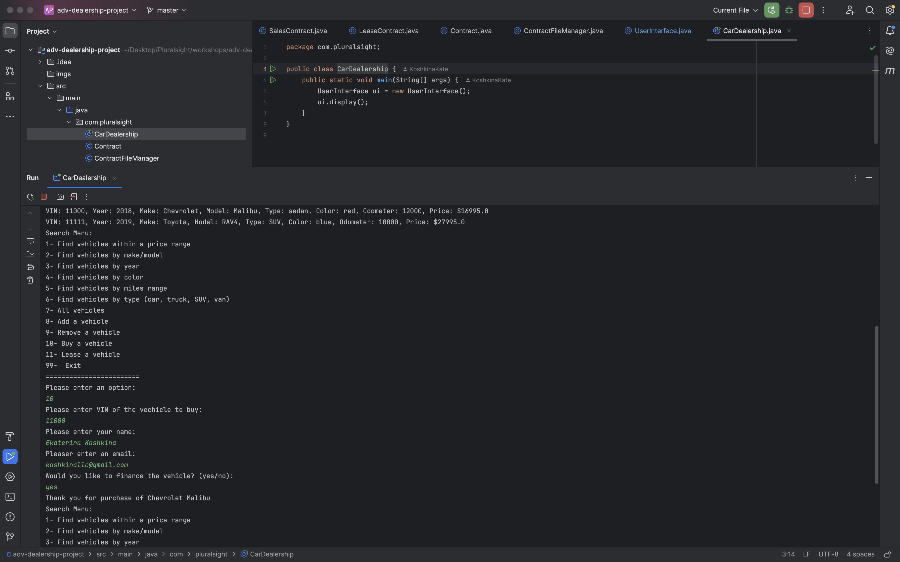
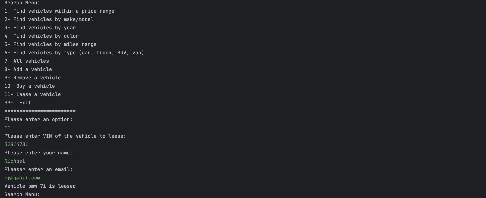
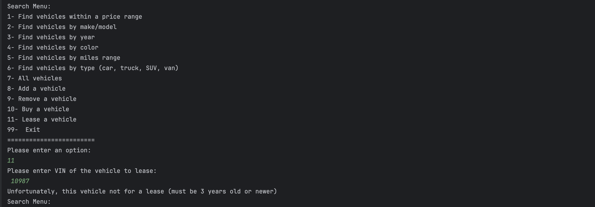

# Dealership

## Description of the Project

This Java console application simulates a dealership management system, allowing users to browse available vehicles, search by various criteria (such as price, make/model, and mileage), and manage the dealership inventory by adding or removing vehicles. Additionally, the application supports creating **sales** and **lease** contracts for customers, with specific criteria such as vehicle age restrictions for leases and customizable contract fees. Users interact with a menu-driven interface to easily view, filter, and modify the inventory or manage contracts.

## User Stories

The following user stories guided the development of this application:

- **As a customer**, I want to view all available vehicles to see the inventory and select a potential purchase.
- **As a customer**, I want to search for vehicles based on price, make/model, year, color, mileage, and type so that I can find the vehicle that best meets my needs.
- **As a user**, I want to add/remove new vehicles to the inventory so that customers have up-to-date options.
- **As a customer**, I want to have the option to buy or lease a vehicle with clear contract details, including total cost and monthly payments if financed.
## Setup

Instructions on how to set up and run the project using IntelliJ IDEA.

### Prerequisites

- IntelliJ IDEA: Ensure you have IntelliJ IDEA installed, which you can download from [here](https://www.jetbrains.com/idea/download/).
- Java SDK: Make sure Java SDK is installed and configured in IntelliJ.

### Running the Application in IntelliJ

Follow these steps to get your application running within IntelliJ IDEA:

1. Open IntelliJ IDEA.
2. Select "Open" and navigate to the directory where you cloned or downloaded the project.
3. After the project opens, wait for IntelliJ to index the files and set up the project.
4. Find the main class with the `public static void main(String[] args)` method.
5. Right-click on the file and select 'Run 'YourMainClassName.main()'' to start the application.

## Technologies Used

- Java 17: This project is written using Java version 17.
- IntelliJ IDEA: Used as the primary Integrated Development Environment (IDE) for coding and running the project.

## Demo
### Purchase of the vehicle

### Car for a lease

### Lease restriction of "must be 3 years old or younger"

## Future Work

- User Authentication: Allow users to create accounts and log in to manage their searches and add to favorites.

## Thanks

- Thank you to Raymond for continuous support and guidance.